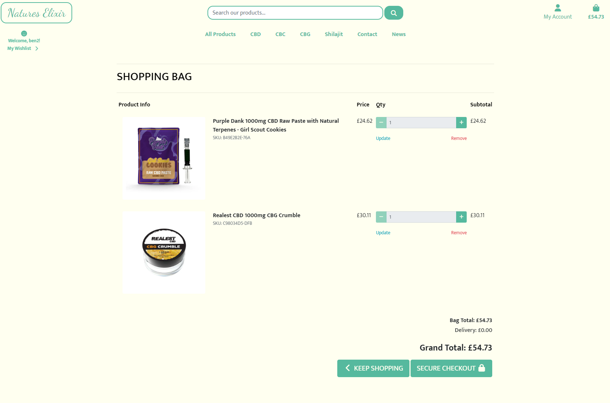

# Features

## Access to pages according to the user role:

| Page Name | Logged out  | Customers  | Manager | Admin |
| --------- | ----------- | ---------- | ------- | ----- |
| Home       | Yes         | Yes        | Yes     | Yes   |
| Login      | Yes         | Yes        | Yes     | Yes   |
| Register   | Yes         | Yes        | Yes     | Yes   |
| Logout     | Yes         | Yes        | Yes     | Yes   |
| Store Products   | Yes         | Yes        | Yes     | Yes   |
| Store Product's Details | Yes         | Yes        | Yes     | Yes   |
| All reviews   | Yes         | Yes        | Yes     | Yes   |
| Bag       | No         | Yes        | Yes     | Yes   |
| Profile   | No         | Yes        | Yes     | Yes   |
| Edit profile   | No         | Yes        | Yes     | Yes   |
| Add address   | No         | Yes        | Yes     | Yes   |
| All addresses   | No         | Yes        | Yes     | Yes   |
| Edit address   | No         | Yes        | Yes     | Yes   |
| My Orders   | No         | Yes        | Yes     | Yes   |
| My Order's Details   | No         | Yes        | Yes     | Yes   |
| My Wishlist   | No         | Yes        | Yes     | Yes   |
| Checkout   | No         | Yes        | Yes     | Yes   |
| Categories | No         | No         | Yes     | Yes   |
| Add category | No         | No         | Yes     | Yes   |
| Edit category | No         | No         | Yes     | Yes   |
| Delete category | No         | No         | No     | Yes   |
| Product's values | No         | No         | Yes     | Yes   |
| Add product's value | No         | No         | Yes     | Yes   |
| Edit product's value | No         | No         | Yes     | Yes   |
| Delete product's value | No         | No         | No     | Yes   |
| Add product | No         | No         | Yes     | Yes   |
| Edit product | No         | No         | Yes     | Yes   |
| Delete product | No         | No         | Yes     | Yes   |
| Orders | No         | No         | Yes     | Yes   |
| Order's details | No         | No         | Yes     | Yes   |
| Edit Order | No         | No         | No     | Yes   |
| Delete order | No         | No         | No     | Yes   |

## Main Features:

- Each page has a navbar and a footer

### Navbar:

The Navbar has two subsections:

- Customer's section, which is visible for all users:

    - The Navbar has the following features:

      
      
        - logo, which redirects to the home page;
        
        
        
        - Products buttons, which redirects the user to the products page

        - Wishlist button, which redirects the user to the wishlist page (if logged in)

        

        - Bag button, which redirects the user to the bag page

        - Profile button, which opens a short menu.

    - if the user is logged out, the Navbar has the following features:
    
      
      
    - if the user is logged in they will see these options with the extra "Product Management" if they are a super user

        
        
        - It has only Store, Wishlist, and Bag buttons, which redirect the user to the store page, wishlist page, and bag page, respectively.

        - Login button, which redirects the user to the login page

        - SignUp button, which redirects the user to the register page

*Navbar is slightly different on the tablet devices*

*Navbar looks as follows on the mobile devices*

*Navbar menu drops down for site navigation on mobile

### Footer:

Footer has the following features:

- Privacy Policy button, which redirects the privacy policy page;

- Social media button for Facebook

- Subscribe to newsletter feature

*Footer is slightly different on the mobile devices*

### Home page:

The home page has is simple and elegant with a SHOP NOW button in the center and a message to let users know about free deliveries over £50

*Home page is slightly different on the mobile devices*

### My profile page:

This page has the saved address and order hostory for the logged-in user.

### Products page:

This page has the following features:

  - Search bar at the top to search for specific products
  - Products by catagory in the varbar
  - A filter by feature
  - Users can see the products that are in the store. The products are displayed in a grid

### Product's details page:

This page has the Product's card with complete data including:
- Add to bag button
- Add to wishlist button
- Quantity toggler
- Thumbs up or down feature for logged in users
- As on all pages, the user can go to their bag my clicking the bag icon in the top right.

### Wishlist page:

This page has the following features:
- A list of items the user has added to their wishlist
- A button to move the item to their bag for purchase
- A button the remove the item from the wishlist

### Bag page:

This page has the following features:
- A list of items the user has added to their shopping bag
- A button to go to secure checkout
- A button to keep shopping that will take them back to the products page
- An item quantity toggler

### Checkout page:

This page has the following features:
- An order summery
- A form for name, contact details and address information
- A card payment section
- A button to adjust their bag items
- A "complete order" button that will process their payment

### Success page:

### Purchase confirmation email:

### Contact page:

This page has the following features:
- A catagory field with two options (product or collaboration)
- A field for the users name
- A field for the users email address
- A field for their message
- A button to submit their question
- This form will send an email with the message to the site owner
- 

This page has the following features:
- News articles that we hope will be engaging for our users and relevent to our product rage

This page has the following features:
- For site admins they have the ability to add products without having to go to the Django admin page
- site admins can access this page clicking "my account" and then "Product management"

- site admins will also have additional edit or delete button at the bottum of the product detail page

- The delete button will bring up a model to confirm deletion of the product

- The edit button will take them to the edit product page

