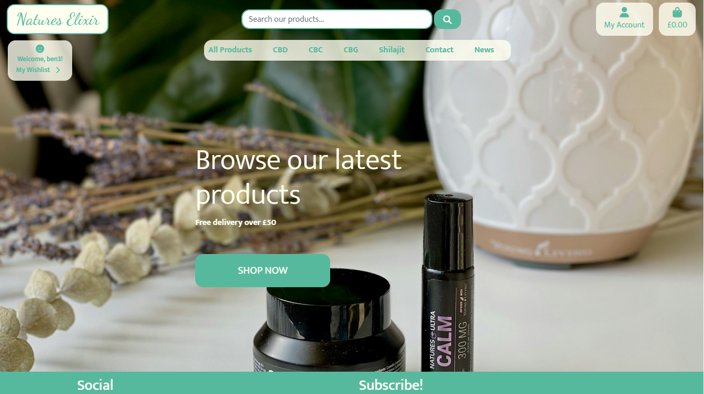
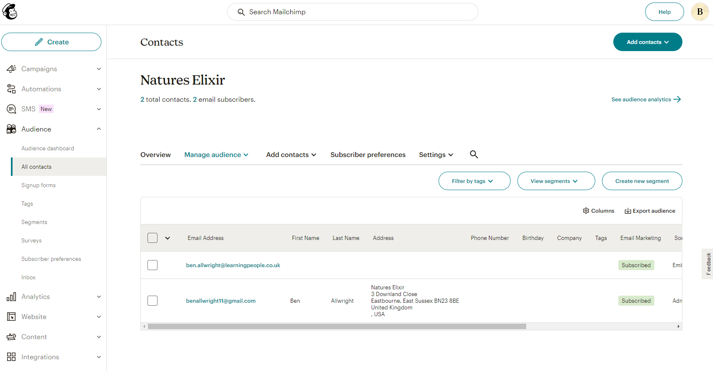
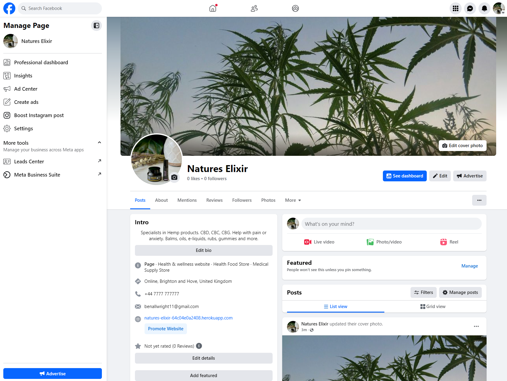
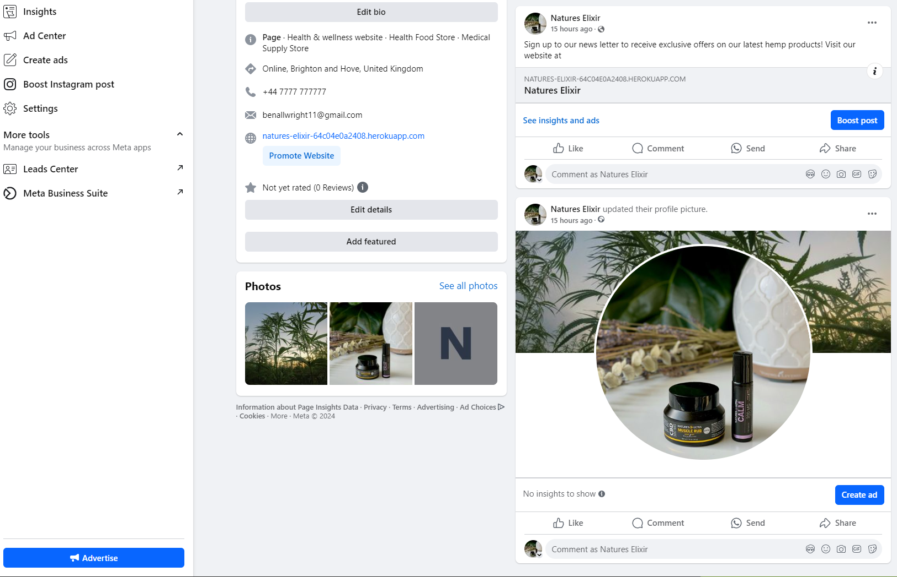

# Natures Elixir website

**Deployed website: [Link to website](https://natures-elixir-64c04e0a2408.herokuapp.com/)**

**Card number for payment testing: 4242424242424242**

## About

"Natures Elixir" is an e-commerce website that spcialises in hemp based products. It has a login system, a shopping bag, a checkout system, and a payment system. Customers can get discounts on their purchases by signing up to the newsletter or by following us on facebook.
In addition, the website has a functionality that allows admins to create, edit or delete products on the website without having to use the django admin page.

## UX

The website was created to be eye-catching and user-friendly. The user is given plenty of choices to choose from when they are shopping. The emphasis is on the user experience; the user can navigate the website easily to fulfill users' goals. The website is designed to be easy to use and easy to understand. Business goals were to make the website as scalable as possible and reusable in the real world.

### Target Audience

This website is intended for people interested in purchasing hemp based products online, such as CBD, CBC, and CBG which are known to help with anxiety, stress and chronic pain. This website has many different products depending on what shoppers are looking for, and it is essential to make sure that the website is easy to use and navigate.

### User Stories

| Issue ID    | USER STORY: Browse items |
|-------------|-------------|
| 2 | As a Shopper I can browse items so that I can easily find what I'm looking for as a user. |

- AC1: Product categories are displayed on the homepage.
- AC2: A search bar is available to filter products by name, price, etc.|

| Issue ID    | USER STORY: User Registration and Authentication |
|-------------|-------------|
| 3 | As a Shopper I can create an account so that I can make purchases and track order history |

- AC1: A registration form that collects name, email, password.|
- AC2: Email verification is sent upon registration.|
- AC3: Users can log in and log out securely.|
- AC4: Forgotten password functionality.|
- AC5: Order history can be seen on the profile page.|

| Issue ID    | USER STORY: Product Details Page |
|-------------|-------------|
| 4 | As a shopper I can view detailed information about a product, so that so that I can make an informed purchase decision content. |

- AC1: Product title, price, description, and images are displayed.|
- AC2: buttons are visible to add to bag and add to wishlist.|
- AC3: Site admin can edit or delete products from this page|

| Issue ID    | USER STORY: Add to Cart |
|-------------|-------------|
| 5 | As a shopper I can add products to my cart so that so that I can purchase them later. |

- AC1: An “Add to Cart” button is present on the product page.
- AC2: The shopping cart icon updates with the total cost.
- AC3: Cart contents are saved even if the user navigates away from the page.

| Issue ID    | USER STORY: Checkout Process |
|-------------|-------------|
| 6 | As a shopper I can securely enter my payment and shipping information so that I can complete my purchase. |

- AC1: A checkout form collects billing, shipping, and payment details.
- AC2: Integration with Stripe for payments.
- AC3: Confirmation email is sent after the order is placed.

| Issue ID    | USER STORY: Admin - Manage Products |
|-------------|-------------|
| 7 | As a Admin I can add, edit, or remove products from the catalogue so that I can manage the store’s inventory. |

- AC1: A product management dashboard is available in the admin panel.
- AC2: Admins can create new products by filling out a form with product details.
- AC3: Admins can edit or delete existing products.

| Issue ID    | USER STORY: Admin - Manage Orders |
|-------------|-------------|
| 8 | As an Admin I can view orders so that I can track and fulfil them efficiently. |

- AC1: Orders are listed with order ID, customer name, date, and status.
- AC2: Admins can update the status of orders (e.g., processing, shipped). (future developemnt)
- AC3: Ability to search orders by customer or order ID.

| Issue ID    | USER STORY: Email Notifications |
|-------------|-------------|
| 9 | As a user I want to receive email notifications so that I stay updated on my orders and promotions. |

- AC1: Users receive an email after placing an order.
- AC2: Users receive promotional emails for sales and offers.
- AC3: Users can opt in or out of promotional emails.

| Issue ID    | USER STORY: Stripe Payment Integration |
|-------------|-------------|
| 10 | As a shopper I can make payments securely using Stripe so that I can complete my purchases confidently. |

- AC1: The checkout form supports Stripe for credit card payments.
- AC2: Users are redirected to a payment success page after successful payment.
- AC3: Payment information is validated and secure.

| Issue ID    | USER STORY: Contact Form |
|-------------|-------------|
| 12 | As a Visitor I can Contact the company so that ask questions about the products/my order |

- AC1: Visitors can easily find the "Contact" tab in the navbar
- AC2: Visitor can fill out a quick and easy form to make contact with the company
- AC3: An email will be sent to the site owner with the visitor details and their question

| Issue ID    | USER STORY: Wishlist |
|-------------|-------------|
| 14 | As a User I want to put items in a wishlist so that I can purchase them later |

- AC1: An "Add to wishlist" button is visible in the product detail page.
- AC2: User wishlist is easy to find on both mobile and desktop.
- AC3: An "Add to bag" button is visible in the wishlist page for users to move wishlist items to the bag for purchase.

| Issue ID    | USER STORY: News |
|-------------|-------------|
| 15 | As a Visitor, I want to see relevant news articles so I can learn more about the hemp industry. |

- AC1: Visitors can easily find the news tab in the navbar
- AC2: Visitors can read a excerpt of news articles
- AC3: Visitors can click on the news articles to read the full story directly from the source

## Business Model

The Business Model is B2C, meaning that the company sells products to customers only.
It focuses on individual transactions only.

### A Persona Summary of the customer

The "Natures Elixir" store is aimed at a diverse group of people considering their needs and wants. As everyone has different needs and wants, the store provides everyone the best possible service.
The age criteria on this website are customers who are 18 and older. The emphasis was made on providing a good user experience for the customers by allowing them to find the products they are looking for, giving them all available options of these products, and offering the best possible service.

### Strategy Trade-Off

"Natures Elixir" is an online store app that is challenging to compete with in the Hemp market due to its wide variety of product offerings and low-cost products.

- a wide variety of product offerings;
- product availability;
- product quality;
- product choice;
- good user experience;
- good service;
- good sales;

---

## Web Marketing

### News Letter

Newsletters have been setup through mailchimp. The manager can create a newsletter and send it to all customers that have registered for the newsletter. to create an email the manager can simply login to mailchimp, go to contacts and click create.

### Facebook

Facebook is essential for the store to be able to reach customers. Facebook has excellent coverage worldwide among people who can purchase products online.

"Natures Elixir" Facebook page is for marketing purposes to post adverts and exciting content to engage with users.

[Link to wefacebook page](https://www.facebook.com/profile.php?id=61566859823022)

---
## Future Development

#### Customer chat

Chat support would provide the customers with the best possible service.

Since this is not essential for the site to fuction as a business this has gone into future development

Facebook and Twitter were not considered for future development at this stage as they require additional information from the business. 
Google is the most popular third-party registration service that is easy to implement; however, it is not available in all countries and regions (like China).

#### Payment system

I want to implement PayPal payment system in the future as many customers prefer it. I am also considering adding google pay and apple pay functionality to the existing stripe payment system as they are widely used due to their simplicity.

#### Order cancellation

This feature requires more research time to implement, which is why it is not implemented at this stage.

---
## Technologies used
- ### Languages:
    
    + [Python 3.10](https://www.python.org/downloads/release/python-3100/): the primary language used to develop the server-side of the website.
    + [JS](https://www.javascript.com/): the primary language used to develop interactive components of the website.
    + [HTML](https://developer.mozilla.org/en-US/docs/Web/HTML): the markup language used to create the website.
    + [CSS](https://developer.mozilla.org/en-US/docs/Web/css): the styling language used to style the website.

- ### Frameworks and libraries:

    + [Django](https://www.djangoproject.com/): python framework used to create all the logic.
    + [jQuery](https://jquery.com/): was used to control click events and sending AJAX requests.
    + [jQuery User Interface](https://jqueryui.com/) was used to create interactive elements.

- ### Databases:

    + [SQLite](https://www.sqlite.org/): was used as a development database.
    + [CI PostgreSQL](https://dbs.ci-dbs.net/): the database used to store all the data in production.
    + [AWS](https://aws.amazon.com/): was used to store all the static files in production.

- ### Other tools:

    + [Git](https://git-scm.com/): the version control system used to manage the code.
    + [Pip3](https://pypi.org/project/pip/): the package manager used to install the dependencies.
    + [Gunicorn](https://gunicorn.org/): the web server used to run the website.
    + [Psycopg2](https://www.psycopg.org/): the database driver used to connect to the database.
    + [Django-allauth](https://django-allauth.readthedocs.io/en/latest/): the authentication library used to create the user accounts.
    + [Django-crispy-forms](https://django-cryptography.readthedocs.io/en/latest/): was used to control the rendering behavior of Django forms.
    + [GitHub](https://github.com/): used to host the website's source code.
    + [VSCode](https://code.visualstudio.com/): the IDE used to develop the website.
    + [Chrome DevTools](https://developer.chrome.com/docs/devtools/open/): was used to debug the website.
    + [Font Awesome](https://fontawesome.com/): was used to create the icons used in the website.
    + [Draw.io](https://www.lucidchart.com/) was used to make a flowchart for the README file.
    + [W3C Validator](https://validator.w3.org/): was used to validate HTML5 code for the website.
    + [W3C CSS validator](https://jigsaw.w3.org/css-validator/): was used to validate CSS code for the website.
    + [JShint](https://jshint.com/): was used to validate JS code for the website.
    + [PEP8](https://pep8.org/): was used to validate Python code for the website.
    + [stripe](https://stripe.com/): was used to create the payment system.
    + [Sitemap Generator](https://www.xml-sitemaps.com/) was used to create the sitemap.xml file.
    + [Privacy Policy Generator](https://www.privacypolicygenerator.info/) was used to create the privacy policy.
    + [Django-extensions](https://django-extensions.readthedocs.io/en/latest/) was used to create a Entity-Relationship Diagram.