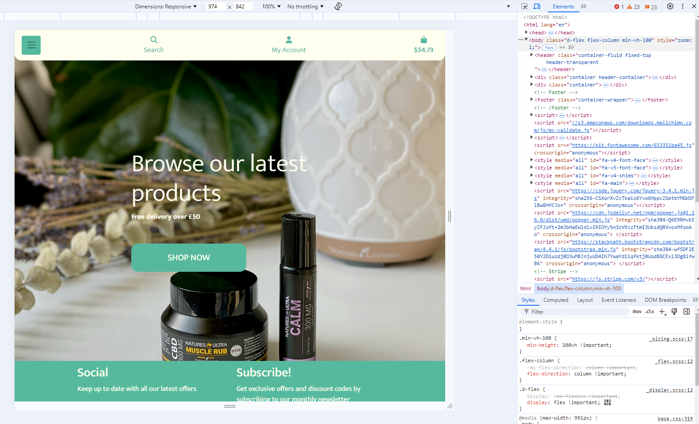
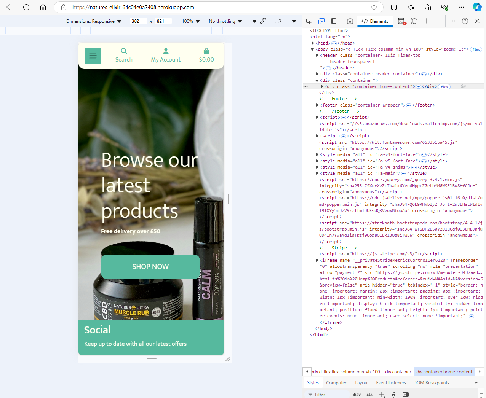
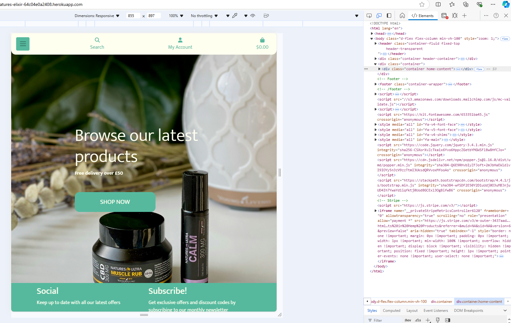

# TESTING

## Manual Testing

Testing was done throughout site development, for each feature before it was merged into the master file.

Usability was tested with the below user acceptance testing, sent to new users to ensure testing from different users, on different devices and browsers to ensure issues were caught and where possible fixed during development.

| Page    | User Actions           | Expected Results | Y/N | Comments    |
|-------------|------------------------|------------------|------|-------------|
| Sign Up     |                        |                  |      |             |
| 1           | Click on Sign Up button | Redirection to Sign Up page | Y |          |
| 2           | Click on the Login link in the form | Redirection to Login page | Y |          |
| 3           | Enter valid email 2 times | Field will only accept email address format | Y |          |
| 4           | Enter valid password 2 times | Field will only accept password format | Y |          |
| 5           | Click on Sign Up button | asks user to confirm email page Sends address a confirmation request email | Y |          |
| 6           | Confirm email | Redirects user to blank Sign In page | Y |          |
| 7           | Sign In | Redirects user to blank In page | Y |          |
| 8           | Sign In with the same email/username and password | Takes user to schedule page with pop-up confirming successful sign in. Get started button now missing in main nav, replaced by Menu | Y |          |
| 9           | Click "Logout" button  in the center of the page| Redirects user to home page | Y |          |
| 10          | Click browser back button | You are still logged out | Y |          |
| Log In      |                        |                  |      |             |
| 1           | Click on Log In button | Redirection to Log In page | Y |          |
| 2           | Click on the Sign Up link in the form | Redirection to Sign Up page | Y |          |
| 3           | Enter valid email | Field will only accept email address format | Y |          |
| 4           | Enter valid password | Field will only accept password format | Y |          |
| 5           | Click on Log In button | Redirects user to blank In page | Y |          |
| 6           | click logout button | Redirects user to home page | Y |          |
| 7           | Click browser back button | You are still logged out | Y |          |
| 8           | Click on Log In button | Redirection to Log In page | Y |          |
| 9           | Enter valid email | Field will only accept email address format | Y |          |
| 10          | Enter valid password | Field will only accept password format | Y |          |
| 11          | Click Remember Me checkbox | Remembers user | Y |          |
| 12          | Click on Log In button | Redirects user to blank In page | Y |          |
| 13          | Click logout button | Redirects user to home page | Y |          |
| 14          | Click browser back button | You are still logged out | Y |          |
| 15          | Click on Log In button | Redirection to Log In page prefilled | Y |          |
| Navigation  |                        |                  |      |             |
| 1           | Click on the logo | Redirection to home page | Y |          |
| 2           | Click All products | Redirection to products page | Y |          |
| 3           | Click wishlist button | Redirection to wishlist page | Y |          |
| 4           | Click bag button | Redirection to bag page | Y |          |
| 5           | Click Profile button | Redirection to Profile page | Y |          |
| 6           | Click Logout button | Redirection to logout page | Y |          |
| Admin Navigation |                        |                  |      |             |
| 1           | Click product management | Redirect to add product page | Y |          |
| Products |                        |                  |      |             |
| 1 | Type in search bar | Search results are displayed | Y |          |
| 2  | Select a category | Products are displayed | Y |          |
| 3 | Click on the product cart | User will be redirected to the product details page | Y | |
| Product Details |
| 1 | Click on "Add to wishlist button" button | Product is added to wishlist and message will appear to notify user | Y | If user is logged out, the user will see a message to login and the click will be ignored |
| 2  | Click on thumbs up or down | User will see their vote incremented | Y |          |
| 3  | Add to bag | Products is added to bag | Y |          |
| 4  | Keep Shopping | User is redirected back to products page | Y |          |
| Wishlist |                        |                  |      |             |
| 1 | Click on empty wishlist button | User will see a dropdown menu with the confirmation message | Y | If user is logged out, the user will see a message to login and the click will be ignored |
| 2 | Click Yes button in the empty wishlist dropdown menu | User will be redirected to the wishlist page  and the message will appear to notify user| Y | If user is logged out, the user will see a message to login and the click will 
| Profile |                        |                  |      |             |
| 1 | Click on the update info button | User will get a notification that their profile as been updated | Y | |
| Bag |                        |                  |      |             |
| 1 | Click on Secure purchase button | The user is redirected to the checkout page | Y | |
| 3 | Click on the minus button | Quantity is decreased and the user will see a message to notify them | Y | If there was only one product in the bag, the product will be removed and the user will see a message to notify them |
| 4 | Click on the plus button | Quantity is increased and the user will see a message to notify them | Y | If there was not enough products in the stock, the quantity will not be increased and the user will see a message to notify them |
| 5 | Click on the remove button | Product is removed from the bag and the user will see a message to notify them | Y | |
| 6 | Click on the keep shopping button | User will be redirected to the products page | Y | |
Checkout |                        |                  |      |             |
| 1 | Type in the Full name | Full name is changed | Y | If user has filled out the profile fully, the filled will be filled automatically |
| 2 | Type in the email | Email is changed | Y | |
| 3 | Type in the phone number | Phone number is changed | Y | If user has set the primary address, the phone number will be set automatically |
| 4 | Type in the address | Address is changed | Y | If user has set the primary address, the address will be set automatically |
| 5 | Type in the post code | post code is changed | Y | If user has set the primary address, the post code will be set automatically |
| 6 | Select country | Country is selected | Y | If user has set the primary address, the country will be set automatically |
| 7 | Select city | City is selected | Y | If user has set the primary address, the city will be set automatically |
| 8 | Type payment card data | Payment card data is changed | Y | |
| 9 | Click on the pay button | The pay button will be disabled and the user will see a message to notify them | Y | If the payment card is not valid, the user will see a message to notify them. If the payment was successful, the user will be redirected to the order placed page and user will also receive an email notification |
| Order Placed |                        |                  |      |             |
| 1 | Click on the my profile button | User will be redirected to the My Orders page | Y | |

## Testing User Story

| First Time Visitor Goals | Requirement met |
| ------------------------- | --------------- |
| As a First Time Visitor, I want to be able to register my account, so that I can learn the benefits of the app as a user | Y |
|  As a First Time Visitor, I want to be able to easily understand the main purpose of the app, so that I can learn more about this app. | Y |
| As a First Time Visitor, I want to be able to easily navigate through the app, so that I can find the content. | Y |
|As a First Time Visitor, I want to be able to find the app useful, so that I can use it according to my needs. | Y |
| As a First Time Visitor, I want to be informed clearly if I am making any errors when registering my account, so that I can be able to fix any errors quickly if I make some. | Y |
| As a First Time Visitor, I want to be able to see the list of products, so that I can learn the benefits of the app as a user. | Y |

| Frequent Visitor Goals    | Requirement met |
| ------------------------- | --------------- |
| As a Regular User, I want to be able to access my account without having to log in every time, so that I can quickly buy a product that I need. | Y | |
| As a Regular User, I want to be sure that my account details are protected, so that I can safely make purchases. | Y |
| As a Regular User, I want to be able to view my data, so that I can easily check my account details and past orders. | Y |
| As a Regular User, I want to be able to add, edit, and save my address data, so that I can make an order faster. | Y | 
| As a Regular User, I want to be able to search products by category, tag, or text search, so that I can find a product faster., s a Regular User, I want to be able to sort products by category, so that I can find the best option to buy. | Y | 
| As a Regular Visitor, I want to be able to see ratings on a product, so that I can make a prudent decision before buying it. | Y | |
| As a Regular User, I want to be able to see the list of products, so that I can learn the benefits of the app as a user. | Y | |
| As a Customer, I want to be able to See a full product description (image, name, description, options, price, discount), so that I can understand whether I want to buy this product. | Y | |
| As a Customer, I want to be able to choose, edit product’s options (size, color, height), so that I can choose an appropriate option of the product. | Y | |
| As a Customer, I want to be able to get an email notification from the shop about special offers, promotions, discounts, so that I can make purchases cheaper. | Y | |
| As a Customer, I want to be able to add product to my wish list, so that I can buy it later. | Y | |
| As a Customer, I want to be able to remove products to my wish list, so that I can keep my wish list up to date. | Y | |
| As a Customer, I want to be able to view products on my wish list, so that I can plan my purchases. | Y | |
| As a Customer, I want to be able to add products to my bag, so that I can easily save products in the bag. | Y | |
| As a Customer, I want to be able to increase/reduce the number of product items in my bag that I want, so that I can buy a number of items that I want. | Y | |
| As a Customer, I want to be able to see the counted total cost of the product, so that I can see how much I will spend. | Y | |
| As a Customer, I want to be able to see the total cost of the products in the bag, so that I can see how much I will spend. | Y | |
| As a Customer, I want to be able to remove the product from my bag, so that I can change my mind not to buy a particular product at the last moment. | Y | |
| As a Customer, I want to be able to see messages from the shop, so that I can understand whether an item is actually added to the bag or removed.   | Y | |
| As a Customer who made a purchase, I want to be able to see order confirmation after checkout, so that I can see what I bought. | Y | |
| As a Customer who made a purchase, I want to be able to receive an email confirmation of my purchase, so that I can have email proof of purchase. | Y | |
| As a Regular user, I want to be able to change my profile data, so that I can keep my profile up to date. | Y | |
| As a Regular User, I want to be able to add, edit, and delete addresses, so that I can be sure that I will receive my order at the correct address. | Y | |
| As a Regular User, I want to be able to change primary address, so that I can set the primary address without editing it. | Y | |

| Manager + Admin Visitor Goals    | Requirement met |
| ------------------------- | --------------- |
| As a Manager, I want to be able to add, edit, and delete products, so that I can keep shop products up to date.  | Y | |
| As a Manager, I want to be able to Add, edit, and delete products’ options (attributes and values), so that I can keep products’ options up to date. | Y | |
| As a Manager, I want to be able to send emails to customers about future promotions, so that I can increase sales by notifying customers about promotions. | Y | |
| As a Manager, I want to be able to view customers' data, so that I can contact customers if needed and solve possible problems with purchases.  | Y | |
| As a Admin, I want to be able to review and edit orders’ status, so that I can control customers’ orders and sales.  | Y | |
| As a Manager, I want to be able to sort products by stock number, so that I can control stock numbers.  | Y | |
| As a Manager, I want to be able to review customers’ orders, so that I can control orders.  | Y | |
| As a Manager, I want to be able to sort orders by date and status, so that I can prioritize orders.  | Y | |

## Bugs

**Solved bugs:**
1. I noticed an issue where some buttons had no hover effects and were not clickable while other buttong on the site with the same classes were working fine.

*Solution:*
I'm ashamed to say that it took me too long to figure out that the overlay I set for each page was covering some buttons because I had put the overlay class inside some of the containers instead of in its own div.

#### There were no unsolved bugs

## Compatibility

Testing was conducted on the following browsers;

- Edge;
- Chrome;

## Validation:

### HTML Validation:

- [Full HTML validation Report](documentation/validation/html_validation.pdf)

- No errors or warnings were found when passing through the official [W3C](https://validator.w3.org/) validator. This checking was done manually by copying the view page source code and pasting it into the validator.

### CSS Validation:

- [Full CSS validation Report](documentation/validation/css_validation.pdf)

- No errors or warnings were found when passing through the official [W3C (Jigsaw)](https://jigsaw.w3.org/css-validator/#validate_by_uri) validator except for the warnings about the use of css root variables and webkits for the box-shadow. However, css code works perfectly on various devices.

### Javascript Validation:

- [Full Javascript validation Report](documentation/validation/python_validation.pdf)

- No errors were found when using JShint [online validation tool](https://jshint.com/). This checking was done manually by copying Javascript code and pasting it into the validator.

### Python Validation:

- [Full Python validation Report](documentation/validation/python_validation.pdf)

- No errors were found when the code was passed through CI Python Linter [online validation tool](https://pep8ci.herokuapp.com/). This checking was done manually by copying python code and pasting it into the validator.

## Lighthouse Report

### Home Page

### About Page

### login Page

### Make Booking Page

### My Bookings Page

# Responsiveness

The responsiveness was checked manually by using devtools (Chrome and Edge) throughout the whole development. It was also checked with [Responsive Viewer](https://chrome.google.com/webstore/detail/responsive-viewer/inmopeiepgfljkpkidclfgbgbmfcennb/related?hl=en) Chrome extension.

### Responsive Viewer Home page

### Responsive Viewer About page

### Responsive Viewer Make bookings page

### Chrome Dev Tools mobile

### Chrome Dev Tools Tablet

### Edge Dev Tools Tablet

### Edge Dev Tools main

### Edge Dev Tools Mobile

